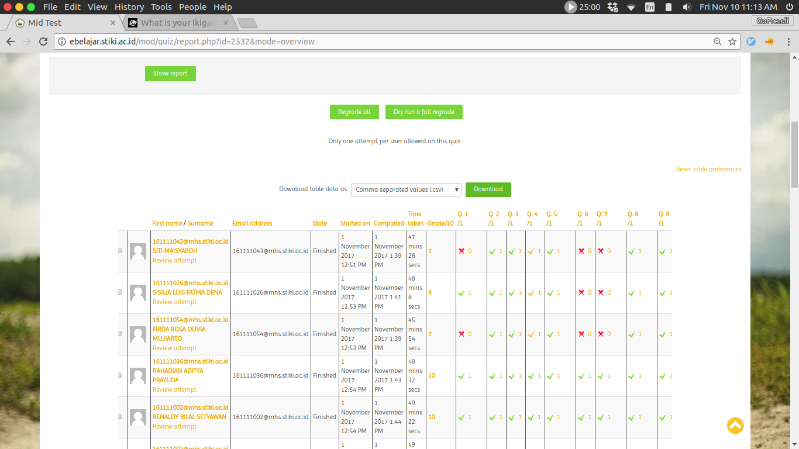
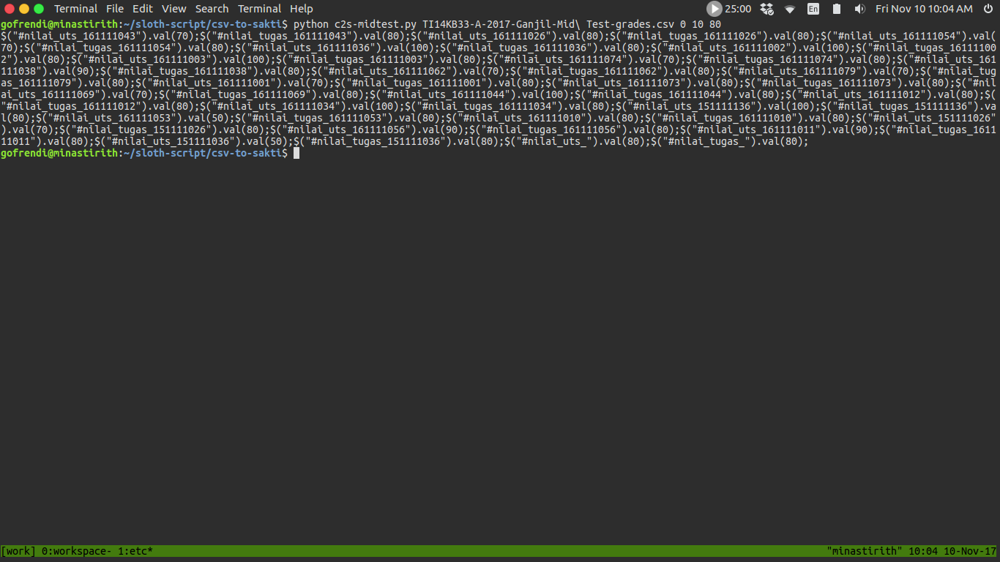

# Moodle CSV --> sakti.stiki.ac.id

Script Python sederhana untuk menyederhanakan hidupku

# Cara Penggunaan

## Import CSV dari moodle

Login ke eblajar, buka halaman `quiz result`, lalu tekan tombol `download as csv`



Sebuah file csv akan otomatis terdownload. Isinya kurang lebih begini:

```csv
Surname,"First name",Institution,Department,"Email address",State,"Started on",Completed,"Time taken",Grade/10,"Q. 1 /1","Q. 2 /1","Q. 3 /1","Q. 4 /1","Q. 5 /1","Q. 6 /1","Q. 7 /1","Q. 8 /1","Q. 9 /1","Q. 10 /1"
"SITI MAISYAROH",161111043@mhs.stiki.ac.id,,,161111043@mhs.stiki.ac.id,Finished,"1 November 2017  12:51 PM","1 November 2017  1:39 PM","47 mins 28 secs",7,0,1,1,1,1,0,0,1,1,1
"SISILIA LUIS FATMA DENA",161111026@mhs.stiki.ac.id,,,161111026@mhs.stiki.ac.id,Finished,"1 November 2017  12:53 PM","1 November 2017  1:41 PM","48 mins 8 secs",8,1,1,1,1,1,0,0,1,1,1
"FIRDA ROSA OLIVIA MUJIARSO",161111054@mhs.stiki.ac.id,,,161111054@mhs.stiki.ac.id,Finished,"1 November 2017  12:53 PM","1 November 2017  1:39 PM","45 mins 54 secs",7,0,1,1,1,1,0,0,1,1,1

...

"FEBRIANUS JEHAMAT ABAT",151111036@mhs.stiki.ac.id,,,151111036@mhs.stiki.ac.id,Finished,"1 November 2017  1:04 PM","1 November 2017  1:53 PM","49 mins 38 secs",5,0,1,1,1,1,1,0,1,0,0
"Overall average",,,,,,,,,8,1,1,1,1,1,1,1,1,1,1
```

## Convert ke Js

* Copykan file tersebut sehingga se-folder dengan `c2s-midtest.py` yang ada dalam folder ini.

* Lakukan konversi. Caranya dengan mengetikkan `python c2s-midtest.py <nama-file-csv> [nilai-minimal-ujian] [nilai-maksimum-ujian] [nilai-tugas-default]` di command-prompt



Pada layar akan ditampilkan script untuk mengisi nilai di sakti.stiki.ac.id secara otomatis. Copykan script tersebut ke clipboard.

## Masukkan nilai ke sakti

* Buka halaman entry nilai pada sakti.stiki.ac.id

* Buka developer tools dengan cara menekan `ctrl + shift + i`, paste script yang telah di-copy di langkah sebelumnya

* Tekan enter, dan nikamati hidupmu

